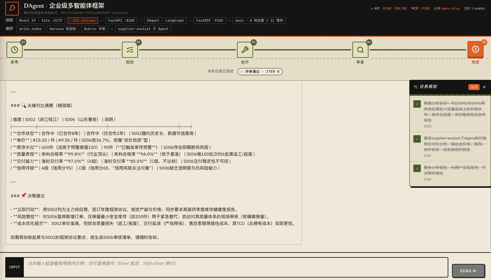

<h1 align="center">DAgent —— 企业级多智能体框架</h1>

<p align="center">
  <a href="http://47.114.36.224:5173/"></a>
  
  
  
  
  
  
  
  
  
</p>

<p align="center"><b>主 Agent 规划 → 委派子 Agent 调工具 → Harness 流水线编排 → Rubric 评审打回重做。一条链路流式可跑：浏览器打字 → 自主调工具 / 委派子 Agent → 评审 → 流式回答。</b></p>

<p align="center">
  <a href="http://47.114.36.224:5173/">在线预览</a> ·
  <a href="#快速开始">快速开始</a> ·
  <a href="#架构与工作原理">架构与工作原理</a> ·
  <a href="#改成你自己的">改成你自己的</a> ·
  <a href="#部署">部署</a> ·
  <a href="#试试这些对话">试试这些对话</a> ·
  <a href="#源码阅读顺序">源码阅读顺序</a> ·
  <a href="#框架能力地图">能力地图</a>
</p>

<p align="center">
  <a href="http://47.114.36.224:5173/"></a>
</p>

一个基于 **LangGraph + LangChain** 的企业级多智能体框架参考实现，承载「摩托车零部件采购助手」场景。主 Agent（协调者）按 `description` 将分析型任务委派给专职子 Agent；Harness 中间件把每次任务编排成「**思考 → 规划 → 执行 → 审查 → 完成**」的流水线；Rubric 评审器对执行结果自动打分，不达标自动打回重做。前端走打字机式 SSE 流式渲染，五节点阶段进度条 + 任务规划面板 + 委派/返工横幅全程可见。

## 快速开始

```bash
# 0. 克隆项目并进入项目根目录（后续所有命令都在根目录执行）
git clone https://github.com/Kehao/DAgent.git dagent && cd dagent

# 1. 后端：创建 Python 虚拟环境并安装依赖
python3 -m venv .venv
./.venv/bin/pip install -r requirements.txt -i https://pypi.tuna.tsinghua.edu.cn/simple

# 2. 配置 LLM Key
cp .env.example .env      # 填入 DASHSCOPE_API_KEY=sk-xxx

# 3. 一键启动 MCP(:9100) + Backend API(:8100)
./start.sh all
# 也可分开：./start.sh mcp / ./start.sh api；停止：./start.sh stop

# 4. 前端：装依赖并启动 Vite 开发服务器(:5173)
cd frontend
npm install                 # 首次需要（npmmirror 镜像已配置）
npm run dev                 # 浏览器打开 http://localhost:5173
```

冒烟测试：

```bash
# 后端单元测试（39 个用例，离线可跑，不依赖任何服务）
./.venv/bin/python -m pytest tests/ -v

# SSE 流式对话冒烟
curl -N -X POST http://127.0.0.1:8100/api/chat/stream \
  -H 'Content-Type: application/json' \
  -d '{"message":"对比 S003 与 S005 后视镜供应商"}'
```

## 你能做什么

开箱即用，至少这几条链路跑得通：

- **聊即查询**：直接问「有哪些供应商」「哪些零件库存偏低」→ Agent 自动选工具 → 打字机返回结果
- **聊即分析**：「对比 S003 与 S005 后视镜供应商，推荐一家」→ 主 Agent **委派子 Agent** `supplier-analyst` → 子 Agent 自查工具出结构化对比表 → 主 Agent 整合呈现
- **聊即评级**：「分析供应商信用评级、评估合作风险」→ 子 Agent 基于量化字段（信用分 / 质量合格率 / 准时交付率）做评级与风险提示
- **全过程可见**：每轮对话顶部 **五节点阶段进度条**（思考→规划→执行→审查→完成），右侧 **任务清单面板**（`write_todos` 逐步勾选），过程 **委派/返工横幅** 滑入提示
- **流式打字机**：SSE 逐 token 推到前端，`bubbles` 实时渲染，评审阶段保留约 5 秒展示停顿让"评审确实发生"可见
- **零外部依赖跑通**：内置 8 家供应商 / 10 种零件虚拟数据 + 同品类多货源比价素材（火花塞 2 家、后视镜 2 家、高强度链条 3 档），对比/评级/风险每类问题都有真实数据可查

## 架构与工作原理

### 架构总览

```
┌──────────────────┐   HTTP/SSE    ┌─────────────────┐   astream    ┌─────────────────────────┐
│  frontend/       │ ────────────▶ │  src/api/       │ ───────────▶ │  src/agent/main_agent.py │
│  React+TS+Vite   │               │  FastAPI  :8100 │              │  DAgent (LangGraph)   │
│  (Vite dev:5173) │ ◀──────────── │  SSE 翻译官     │              │  LLM qwen + 工具调度      │
└──────────────────┘   data: JSON  └─────────────────┘              └───────────┬─────────────┘
                                                            MCP tools 加载   │ 调用工具
                                                            (streamable_http) ▼
                                                                    ┌─────────────────┐
                                                                    │ src/mcp_server/ │
                                                                    │ FastMCP  :9100  │
                                                                    └────────┬────────┘
                                                                             │ 读取
                                                                    ┌────────▼────────┐
                                                                    │ src/data/       │
                                                                    │ mock_data.py    │
                                                                    │ (虚拟供应商/零件) │
                                                                    └─────────────────┘
```

**一句话链路**：前端打字 → `POST /api/chat/stream`(SSE) → FastAPI 驱动 DAgent(LangGraph) → Agent 按需调 FastMCP(:9100) 工具 → 工具读虚拟数据 → 结果流式回前端打字机渲染。

> 端口：**MCP :9100 / API :8100 / 前端 :5173**。`.env` 可改 `MCP_SERVER_URL` / `API_PORT`，多实例部署互不冲突。

### Harness 阶段机 + Rubric 评审

进阶机制（`src/agent/middlewares/harness.py` + `harness_config.yaml`）—— 中间件把每次任务编排成「**思考 → 规划 → 执行 → 审查 → 完成**」的生产线，Rubric 评审器对执行结果自动打分，**不达标自动打回重做**（带重试上限）。前端五节点进度条 + 评审判定 chip（✓ 评审通过 / ↻ 要求修改 / ⚠ 已达上限…）是这套机制的观测出口，不了解时忽略即可，不影响主链路使用。

### 委派子 Agent

主 Agent（协调者）按 `description` 把分析型任务委派给专职子 Agent。当前内置 `supplier-analyst`（覆盖 4 类任务：多供应商对比 / 信用评级 / 供货与价格差异 / 风险与推荐），yaml 声明式注册，加一个新子 Agent = 加一个 yaml 文件，不用改主 Agent 代码（`src/agent/subagents/` loader 子串匹配工具）。

> 数据隔离细节：`src/api/main.py` 循环开头的 `if namespace: continue` —— 子 Agent 是幕后执行者，它的图内消息要按 namespace 隔离，不能与主 Agent 输出串台。

## 目录结构

| 目录/文件 | 角色 | 设计要点 |
|---|---|---|
| `src/mcp_server/server_main.py` | MCP Server，暴露业务工具 | `@mcp.tool()` 一个函数 = 一个能力 |
| `src/agent/main_agent.py` | 组装主 Agent | `create_deep_agent(model, tools, middleware, subagents)`：TodoListMiddleware（规划）+ Harness/Rubric + 委派子 Agent |
| `src/agent/mcp_client.py` | Agent 连 MCP 拿工具 | `MultiServerMCPClient` + streamable_http |
| `src/agent/subagents/` | 子 Agent：yaml 声明式委派 | 加子 Agent = 加一个 yaml；loader 工具子串匹配 |
| `src/agent/middlewares/harness.py` + `harness_config.yaml` | Harness 中间件（阶段机 + 评审 DSL） | 规划→执行→评审→终态；rubric 不达标自动打回 |
| `src/api/main.py` | FastAPI + SSE 翻译 | `astream()` 逐 token 转发；values 流广播 phase / todo_update / review_result（10 种事件）；终帧插入审查展示停顿 |
| `src/api/agent_loader.py` | Agent 单例持有 | 懒加载 + 单例 |
| `src/data/mock_data.py` | 虚拟数据 | 内存数据替代外部系统，即开即用 |
| `src/config.py` | 环境变量总入口 | LLM/MCP 地址集中管理 |
| `tests/` | 三层单测：MCP 工具 / Harness 纯逻辑 / 子 Agent loader | `pytest` 全离线，`FunctionTool.fn` 取原始函数测工具 |
| `frontend/` | React+TS+Vite 聊天页 | 见下方 |
| `deploy/` | systemd 部署模板（`dagent-mcp.service` / `dagent-api.service` + `install.sh`） | 见 [部署到阿里云](#阿里云-ecs-部署实录agentkehaoinfo) |

### 前端内部结构（React + TS + Vite）

```
frontend/
  src/
    main.tsx                 React 挂载入口（createRoot + StrictMode）
    App.tsx                  页面骨架（单向数据流装配）
    types.ts                 前后端协议类型（SSE 事件 discriminated union）
    lib/
      sse-parser.ts          SSE 粘包解析（半包/粘包 + buffer 累积）
      api.ts                 流式请求封装（fetch + reader.read() 循环）
      prompts.ts             常用提示词数据（按能力分组，加新建议=加数据）
    hooks/
      useChat.ts             聊天状态机（useReducer：一个事件一个 case）
    components/
      ChatArea.tsx                  消息气泡渲染（按 kind 分四种气泡）
      HarnessPhaseBar.tsx           顶部五节点阶段进度条（流光/弹跳动画）
      TodoListPanel.tsx             右侧任务规划面板（可拖拽 fixed 定位）
      InterruptBanner.tsx           过程横幅（委派子 Agent / 评审返工）
      InputBar.tsx                  输入区（Enter 发 / Shift+Enter 换行 + 常用提示词面板）
    styles.less                    全局样式（工业装配线视觉：奶白/炭黑/暖橙/橄榄）
```

## 改成你自己的

内容与表现是分离的，改业务基本只动数据文件：

| 想改什么 | 改哪里 |
|---|---|
| 主 Agent 人设 / 系统提示词 | `src/agent/main_agent.py` 的 `system_prompt` 与 `subagents` 列表 |
| 加一个新业务子 Agent | `src/agent/subagents/` 加一个 yaml（`name` / `description` / `prompt`），loader 自动接管 |
| 加一个新业务工具 | `src/mcp_server/server_main.py` 加一个 `@mcp.tool()` 函数；放数据/逻辑到 `src/data/` 或业务模块 |
| Harness 阶段顺序 / 评审规则 | `src/agent/middlewares/harness.py` + `harness_config.yaml`（阶段机 + Rubric DSL） |
| 切换 LLM（换 qwen 之外） | `src/config.py` 改 `LLM_MODEL` / `.env` 改 `DASHSCOPE_API_KEY`（或换 OpenAI 兼容端点） |
| 接入真实业务数据 | 把 `src/data/mock_data.py` 替换成 ERP / 业务系统 HTTP 客户端，工具签名保持不变即可 |
| 前端视觉/样式 | `frontend/src/styles.less`（设计令牌集中在文件头变量） |
| 加新提示词建议 | `frontend/src/lib/prompts.ts` 加一条数据，UI 自动渲染 |
| 调整消息气泡 / 阶段进度条 | `frontend/src/components/ChatArea.tsx` / `HarnessPhaseBar.tsx` |

## 部署

架构上是**纯前端 + 两个 Python 常驻服务**，可按平台自由拆分：

```
┌────────────────────────┐   HTTPS/SSE   ┌──────────────────────┐  streamable_http  ┌─────────────────────┐
│ 静态前端 dist/          │ ────────────▶ │  FastAPI API :8100   │ ─────────────────▶ │  FastMCP Server :9100 │
│ (Vercel / CF Pages /   │              │  (Render / Fly.io /  │                    │  与 API 同机或分机    │
│  GitHub Pages / Nginx) │ ◀─────────── │   云主机 systemd)    │ ◀───────────────── │                     │
└────────────────────────┘              └──────────────────────┘                    └─────────────────────┘
```

### ① 前端（静态托管，任意支持静态站点的平台）

```bash
cd frontend
# 关键：把 API_BASE 指到真实后端（不设则生产走同源相对路径 /api/...）
VITE_API_BASE=https://api.your-domain.com npm run build
# → 产出 dist/，整目录上传托管平台即可
```

- 平台侧建环境变量 `VITE_API_BASE`（**构建期**注入，改后需重新 build）；例如 Vercel / Netlify / Cloudflare Pages 的 Project Settings → Environment Variables。
- 若后端与前端**同域**（如 Nginx/Caddy 把 `/api` 反代到 :8100），可不设该变量——构建产物自动用相对路径，无跨域问题。
- 本地想预览 build 产物并连本机后端：`VITE_API_BASE=http://localhost:8100 npm run preview`。
- 后端 CORS 当前 `allow_origins=["*"]` 仅为开发便利；生产建议在 `src/api/main.py` 收紧为真实前端域名。

### ② 后端两个 Python 服务（选支持长驻进程的平台）

```bash
# 每个平台实例执行一次（Render/Railway/Fly.io 的 Start Command 或云主机 systemd）：
python3 -m venv .venv && ./.venv/bin/pip install -r requirements.txt
cp .env.example .env      # 填 DASHSCOPE_API_KEY；API 与 MCP 分机部署时，
                          # MCP 机的 MCP_SERVER_URL 要能被 API 机访问
./.venv/bin/python -m src.mcp_server.server_main &   # MCP :9100
./.venv/bin/python -m src.api.main                   # API :8100（前台）
```

- 平台若强制单进程单端口（如 Render Web Service），可用 Nginx/Caddy 做内部反代，或把两个服务放同一容器。
- 端口可用环境变量覆盖：`API_PORT` / `MCP_SERVER_URL`（见 `src/config.py`）。
- SSE 流经反代时若被缓冲导致前端"假死"，确认反代已关闭缓冲（响应头 `X-Accel-Buffering: no` 已内置，Nginx 侧可再加 `proxy_buffering off;`）。

### 阿里云 ECS 部署实录（agent.kehao.info）

> 生产环境部署到阿里云大陆 ECS 的完整记录：**前置约束（域名备案）+ 服务器环境 + systemd 启停命令**。
> 部署架构与"部署到第三方平台"①/② 一致：前端静态由 Nginx 托管，`/api/` 同域反代到 :8100。

#### 部署清单（本机/服务器两侧）

| 内容 | 位置 / 命令 |
|---|---|
| 代码目录 | 服务器 `/opt/dagent`（本地 tar 打包 → `workbench upload` 上传解压；GitHub 直连在国内 ECS 上不稳） |
| 前端产物 | 服务器 `/var/www/agent-www`（本地 `npm run build` 后上传；**不设 `VITE_API_BASE`** → 走同源相对 `/api/`） |
| Python | 系统自带 3.10 **不够**（deepagents 0.7.10 需 ≥3.11）→ 用 python-build-standalone 装 **3.12.14** 到 `/opt/python` |
| venv | `/opt/dagent/.venv`（`/opt/python/bin/python3 -m venv .venv`） |
| 环境变量 | `/opt/dagent/.env`（由 `.env.example` 复制，填真实 `DASHSCOPE_API_KEY`） |
| Nginx 站点 | `/etc/nginx/sites-available/agent` → 软链进 `sites-enabled`；`server_name agent.kehao.info`，`listen 80 + 81` |

#### 服务管理（systemd，开机自启）

```bash
# 登录服务器（root）
ssh root@47.114.36.224

# ---------- 启动 ----------
systemctl start dagent-mcp.service    # MCP Server  :9100（业务工具）
systemctl start dagent-api.service    # Backend API :8100（SSE 对话端点）
# 注：dagent-api 依赖 dagent-mcp（Unit 里 Requires/After 已声明），先起 mcp 更稳

# ---------- 停止 ----------
systemctl stop dagent-api.service
systemctl stop dagent-mcp.service

# ---------- 重启（改代码/改 .env 后） ----------
systemctl restart dagent-api.service
systemctl restart dagent-mcp.service

# ---------- 查看状态 ----------
systemctl status dagent-api.service          # 状态 + 最近日志
systemctl is-active dagent-mcp dagent-api    # 输出 active 即健康

# ---------- 查看/跟踪日志 ----------
journalctl -u dagent-api.service -f          # 实时跟踪 API 日志（-f 跟随）
journalctl -u dagent-mcp.service --no-pager | tail -50
journalctl -u dagent-api.service --since "10 min ago"

# ---------- Nginx ----------
systemctl reload nginx            # 改 nginx 配置后热加载（nginx -t 先自检）
systemctl restart nginx           # 必要时重启
nginx -t                          # 配置语法自检
```

systemd 单元模板见 `deploy/dagent-mcp.service` / `deploy/dagent-api.service`，一键安装：

```bash
sudo bash deploy/install.sh    # 自动装到 /etc/systemd/system + daemon-reload + enable
```

#### 日常维护速查

```bash
# 更新代码：本地打包 → 上传 → 覆盖（以 2026-09 实操为准）
#   tar --exclude={.venv,node_modules,.git,.workbuddy} -czf src.tar.gz .  # 本地
#   workbench upload src.tar.gz /opt/ --instance-id <实例ID> --force        # 上传
#   tar -xzf /opt/src.tar.gz -C /opt/dagent && systemctl restart dagent-*   # 解压+重启

# 访问入口（⚠️ 域名未完成 ICP 备案前，80/443 被阿里云拦截，走 81）
#   备案完成前：http://agent.kehao.info:81/     （nginx 已 listen 81，安全组需放行 81）
#   备案完成后：http://agent.kehao.info/  （或 443 + certbot 签证书）

# 健康检查（服务器本机）
curl -s http://127.0.0.1:8100/health          # {"status":"ok",...}
curl -s http://127.0.0.1:81/health            # 经 nginx 反代同款

# 完整链路冒烟：SSE 流式对话
curl -N -X POST http://127.0.0.1:8100/api/chat/stream \
  -H 'Content-Type: application/json' \
  -d '{"message":"有哪些供应商"}'
```

> ⚠️ **ICP 备案提醒**：阿里云大陆 ECS 会对未备案域名**强制阻断 80/443**（响应 `Server: Beaver` / "Non-compliance ICP Filing"）。`agent.kehao.info` 部署时即遇此拦截——备案通过前请用 **81 端口**访问；域名备案/接入（beian.aliyun.com）审核通过后 80/443 自动放行，无需改服务器。
> ⚠️ 实例安全组需放行所用端口：本次 81 端口公网不可达就是安全组未放行所致（控制台 → ECS → 安全组 → 入方向 → TCP 81/81 允许 0.0.0.0/0）。

## 试试这些对话

| 输入 | 预期行为 |
|---|---|
| "查一下有哪些供应商" | Agent 调用 `supplier_search` → 列出全部在册供应商（当前 8 家） |
| "帮我看看哪些零件库存偏低了" | Agent 调用 `stock_warning` → 列出低于 100 的零件 |
| "有没有卖轮毂的供应商？" | Agent 调用 `part_search` 找轮毂 → 关联到钱江 |
| "对比分析一下这几家供应商谁更适合长期合作？" | Agent **委派子 Agent**（`task` 工具 → supplier-analyst）→ 子 Agent 自查工具出结构化对比报告 → 主 Agent 整合呈现 |
| "对比 S003 与 S005 后视镜供应商，推荐一家" | 委派 supplier-analyst → 按价格 / 供货能力 / 合作风险三维度量化对比 → 输出对比表 + 明确推荐 |
| "分析供应商信用评级、评估合作风险" | 委派 supplier-analyst → 基于评级分 / 质量合格率 / 准时交付率等量化字段评级与风险提示 |
| "你好" | Agent 纯文本回复（**不**调用工具）|

> 虚拟数据（`src/data/mock_data.py`）：**8 家供应商 / 10 种零件**，专为子 Agent 分析任务设计 ——
> 每家档案含 3 个**量化字段**（`creditScore` 评级分 / `qualityPassRate` 质量合格率 / `onTimeDeliveryRate` 准时交付率），
> 并埋了多组**同品类多货源**比价素材（火花塞 2 家、后视镜 2 家、高强度链条 3 家 65/58/70 三档），
> 让"对比多家 / 信用评级 / 供货与价格差异 / 风险与推荐"每类问题都有真实数据可查。

> 同一轮对话顶部会实时显示 **Harness 阶段进度条**：
> 思考 🧠 → 规划 📝 → 执行 ⚙️ → 审查 🔍 → 完成 ✅
> 当前阶段节点蓝底高亮 + 图标脉冲，已过节点变绿，未到节点灰色，连接线随状态变色；
> 进度条底行还会显示 **当前阶段描述**（如"正在调用工具执行任务…"）和
> **评审判定 chip**（✓评审通过 / ↻要求修改 / ⚠已达上限…）。
> 这是进阶机制 `src/agent/middlewares/harness.py` 的观测出口，不了解时忽略即可，不影响主链路使用。
>
> 同一轮还会看到 **TodoListPanel**（右侧任务清单，写 todos 后逐步勾选完成）和
> **InterruptBanner**（委派子 Agent / 评审返工时的过程横幅）。
> 审查阶段特意保留约 5 秒展示停顿（`api/main.py` 的 `REVIEW_PAUSE_SECONDS`），
> 让"评审确实发生"可见；这是演示用行为，真实产品应移除。

## 源码阅读顺序（推荐路线）

1. `src/config.py` —— 看配置怎么集中管理
2. `src/mcp_server/server_main.py` —— 看"工具"长什么样（最简单）
3. `src/agent/mcp_client.py` → `src/agent/main_agent.py` —— 看工具如何被 Agent 拿到并组装
4. `src/api/main.py` —— 看 `astream()` 如何驱动 Agent 并翻译成 SSE（**核心**）
5. `src/agent/middlewares/harness.py` + `harness_config.yaml` —— 进阶：Harness 阶段状态机 + rubric 评审
   （`middleware` 注册顺序、`after_agent` 逆序执行是关键，模块 docstring 有完整讲解）；
   `main_agent.py` 另装配了 LangChain 内置 `TodoListMiddleware`（`write_todos` 工具 →
   `state.todos`），`_build_plan_from_todos` 把它同步成结构化 plan —— 规划机制的真正数据源
6. `src/agent/subagents/` —— 进阶：子 Agent 委派。yaml 声明"人设"→ loader 子串匹配
   工具 → `create_deep_agent(subagents=...)` 自动暴露 `task` 工具；
   当前 supplier-analyst 覆盖 4 类分析任务（多供应商对比 / 信用评级 / 供货与价格差异 /
   风险与推荐），提示词里明确了量化字段读取口径；
   留意 `src/api/main.py` 循环开头 `if namespace: continue` —— 子 Agent
   是幕后执行者，它的图内消息要按 namespace 隔离，不能与主 Agent 输出串台
7. `frontend/src/lib/sse-parser.ts` → `src/lib/api.ts` —— 看浏览器如何逐段解析 SSE（打字机来源）
8. `frontend/src/hooks/useChat.ts` → `components/*` —— 看 SSE 事件如何变成界面气泡（`useReducer` 状态机）
9. `frontend/src/components/HarnessPhaseBar.tsx` —— 进阶：五节点进度条如何从后端 phase 事件还原成流水线视觉（含动画）
10. `frontend/src/components/TodoListPanel.tsx` / `InterruptBanner.tsx` / `lib/prompts.ts` —— 进阶：任务清单面板、
    委派 / 返工横幅、常用提示词入口如何消费 `todo_update`、`tool_start(task)` 等事件（`useChat.ts` reducer 是对照表）

## 框架能力地图（当前实现 vs 演进方向）

| 能力维度 | 当前实现 | 演进方向 |
|---|---|---|
| 数据源 | 内存虚拟数据（mock_data） | 接入真实 ERP / 业务系统 HTTP 接口 |
| 持久化 | 无，每轮独立 | MongoDB：会话 / checkpoint / store |
| 多 Agent 协作 | 主 Agent + Harness 阶段机 + Rubric 评审 + 专职子 Agent supplier-analyst（多供应商对比 / 信用评级 / 供货与价格差异 / 风险与推荐，8 家供应商档案带量化字段支撑） | 按需注册更多业务子 Agent（每个 = 一个 yaml） |
| 代码执行 | 无沙箱 | Docker 沙箱执行代码 |
| 前端 | React+Vite + Less + 打字机 + 五节点阶段进度条（流光 / 弹跳动画）+ TodoListPanel + InterruptBanner + 常用提示词入口 | 审批卡片 / 人工介入（HITL，需引入 checkpointer） |

## 技术栈

Python 3.12 · LangGraph 1.2 · LangChain 1.3 · deepagents 0.7.10 · FastAPI · FastMCP 2.14 · pytest  
React 19 · TypeScript · Vite 8 · Less · zustand（state） · SSE（流式协议）

LLM：默认 DashScope `qwen-plus`（OpenAI 兼容端点，可在 `src/config.py` + `.env` 切到任意兼容服务）

## 许可与版权

- **本仓库**暂未附带 `LICENSE` 文件，作为参考实现公开——欢迎阅读、学习、fork；fork 后用于商业发布前请自行补充 `LICENSE`。
- 仓库内业务场景相关的虚拟数据（`src/data/mock_data.py` 的供应商 / 零件档案）专为子 Agent 分析任务设计，可整体替换为你自己的业务系统数据源。
- 在线预览部署在作者个人阿里云 ECS（agent.kehao.info），仅作演示，不保证 SLA。
